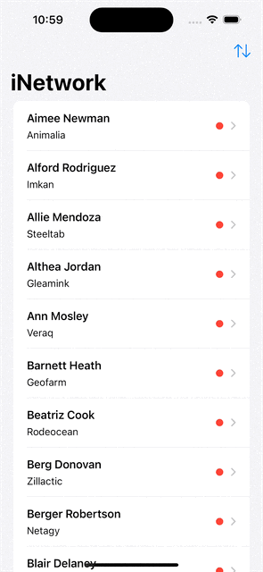

# iNetwork
An iOS app featuring a list of users with their details and connection to other users fetched from the internet.

This project has two branches:
- main
- feature/swift-data

The feature/swift-data branch uses SwiftData to persist fetched data.
## Featuring
- Observation
- SwiftData
- Programmatic Navigation
- URLSession
## App Preview
This demo features the feature/swift-data branch
*Please wait for the demo GIF to load*

  

## LICENSE

[MIT](LICENSE)
